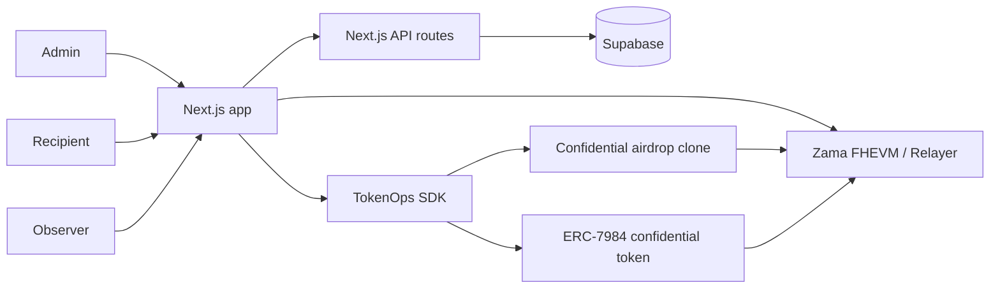
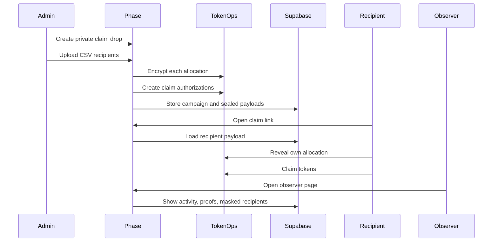

# Phase

Phase is a confidential token distribution app for the Zama Developer Program Season 3 TokenOps bounty.

It lets teams launch private ERC-7984 token distributions where recipients reveal only their own allocation and observers can verify claim activity without seeing amounts or recipient identities.

## Features

- Claim-first admin flow for private token distributions.
- CSV import for `address,amount` recipient lists.
- TokenOps-backed encrypted claim payloads and EIP-712 claim authorizations.
- Recipient reveal flow using Zama user decryption.
- Observer view with visible activity, masked recipients, sealed amounts, and proof status.
- Demo cUSDC faucet flow for Sepolia testing.
- Supabase-backed campaign, claim, and vesting metadata.

## Architecture



## Claim Flow



## Repository Layout

```text
.
|-- frontend/          # Next.js app, API routes, and UI flows
|-- contracts/         # Hardhat package for legacy/reference contract work
|-- docs/              # Architecture and flow notes
|-- supabase/          # Database schema
|-- internal-docs/     # Launch article, video script, and bounty planning notes
|-- .env.example       # Local environment template
`-- pnpm-workspace.yaml
```

## Prerequisites

- Node.js 20+
- pnpm 10+
- Supabase project
- Sepolia wallet with ETH for gas

## Quick Start

```bash
pnpm install
cp .env.example frontend/.env.local
pnpm dev
```

Open `http://localhost:3000`.

The root `pnpm dev` command runs the frontend package:

```bash
pnpm --filter phase-frontend dev
```

## Environment

Edit `frontend/.env.local` after copying `.env.example`.

Required for local app usage:

```bash
NEXT_PUBLIC_CHAIN_ID=11155111
NEXT_PUBLIC_RPC_URL=https://ethereum-sepolia-rpc.publicnode.com
NEXT_PUBLIC_APP_URL=http://localhost:3000

NEXT_PUBLIC_DEFAULT_CONFIDENTIAL_TOKEN=
NEXT_PUBLIC_CUSDC_TOKEN_ADDRESS=
NEXT_PUBLIC_CUSDC_FAUCET_ADDRESS=

SUPABASE_URL=
SUPABASE_SERVICE_ROLE_KEY=
```

Optional:

```bash
NEXT_PUBLIC_TOKENOPS_FACTORY_ADDRESS=
NEXT_PUBLIC_PHASE_REGISTRY_ADDRESS=
NEXT_PUBLIC_SUPABASE_URL=
NEXT_PUBLIC_SUPABASE_PUBLISHABLE_KEY=
OPERATOR_PRIVATE_KEY=
RPC_URL=
MNEMONIC=
ETHERSCAN_API_KEY=
```

Notes:

- `NEXT_PUBLIC_TOKENOPS_FACTORY_ADDRESS` is optional on Sepolia because TokenOps resolves the factory by default.
- Use `SUPABASE_URL` and `SUPABASE_SERVICE_ROLE_KEY` for deployed server runtimes.
- `NEXT_PUBLIC_SUPABASE_URL` and `NEXT_PUBLIC_SUPABASE_PUBLISHABLE_KEY` are only a local/demo fallback.
- `OPERATOR_PRIVATE_KEY` is not required for the default browser-driven demo flow.

## Supabase Setup

1. Create a Supabase project.
2. Run `supabase/schema.sql` in the Supabase SQL editor.
3. Add the Supabase env vars to `frontend/.env.local`.
4. Add the same server env vars to Vercel or your deployment target.

## Scripts

Run commands from the repository root.

```bash
pnpm dev              # Start the Next.js app
pnpm build            # Build the frontend
pnpm lint             # Lint the frontend
pnpm typecheck        # Typecheck frontend and contracts package
pnpm contracts:compile
pnpm contracts:test
pnpm contracts:deploy:sepolia
```

Package-specific commands:

```bash
pnpm --filter phase-frontend dev
pnpm --filter phase-frontend build
pnpm --filter phase-frontend lint
pnpm --filter phase-frontend typecheck
pnpm --filter phase-contracts build:ts
```

## Product Routes

- `/` - product dashboard and entry points.
- `/admin` - create a private claim drop, with batch and vesting as secondary modes.
- `/claim/[campaignId]` - recipient claim and reveal flow.
- `/observer` - campaign observer index.
- `/observer/[campaignId]` - observer activity view for one distribution.
- `/recipient` - recipient workspace.
- `/faucet` - demo cUSDC faucet.

## Validation

Before submitting or deploying:

```bash
pnpm lint
pnpm typecheck
pnpm build
```

## Contracts

The main Phase app uses TokenOps for the confidential claim-distribution lifecycle on Sepolia. The `contracts/` workspace is retained for legacy/reference work and optional registry experiments; it is not required for the primary demo path.

## Bounty Submission Checklist

- Deployed website with working admin, recipient, and observer flows.
- TokenOps SDK used for encrypted claim setup, reveal, and claim execution.
- ERC-7984 confidential token configured on Sepolia.
- Recipient reveal uses Zama user decryption.
- Observer page proves activity while keeping amounts and recipients sealed.
- Three-minute launch demo video.
- Public launch article or thread.
